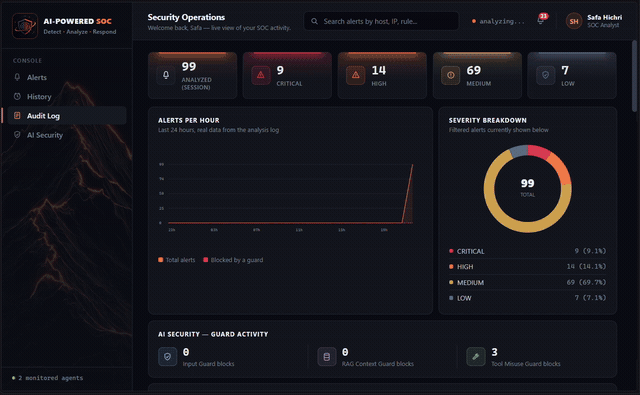
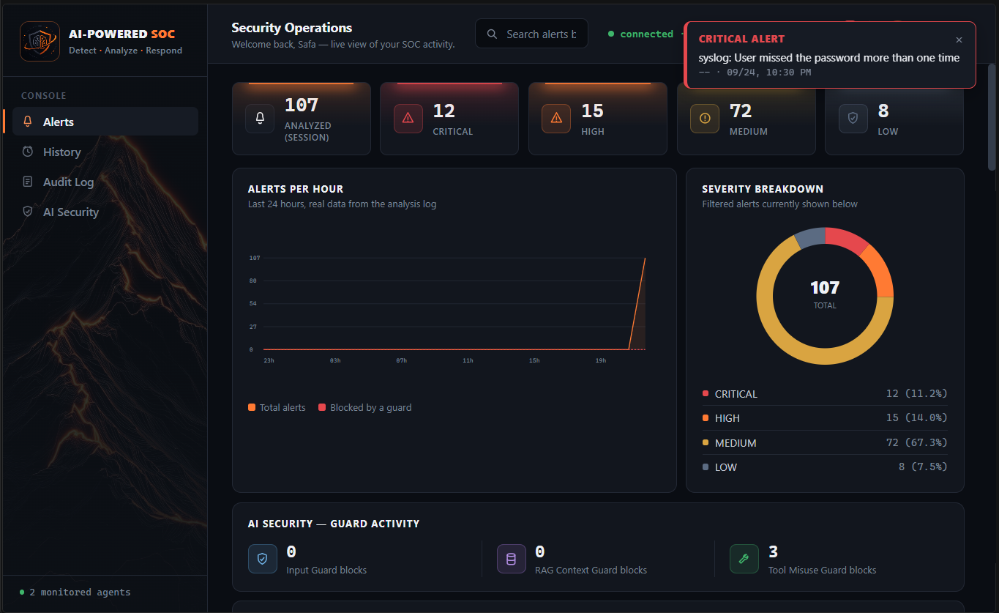
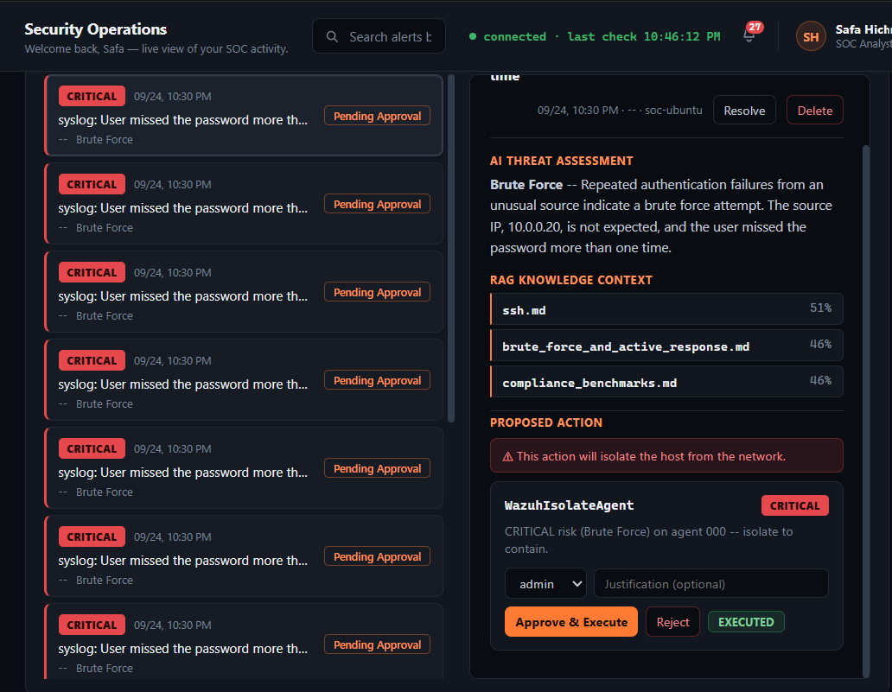
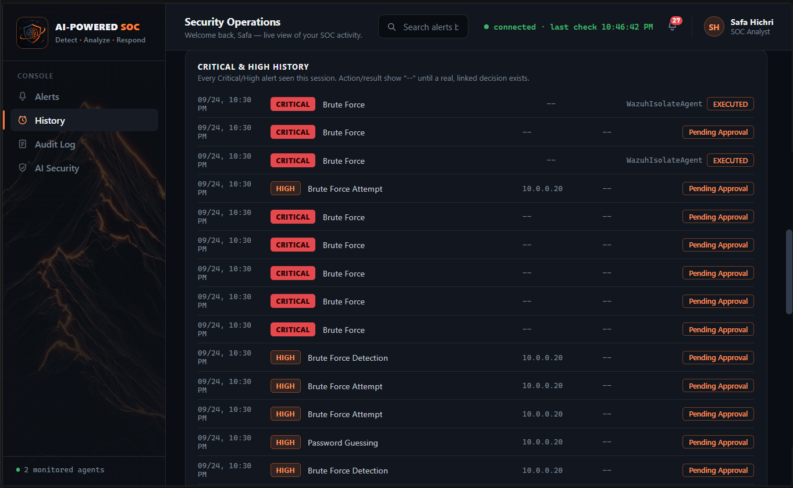
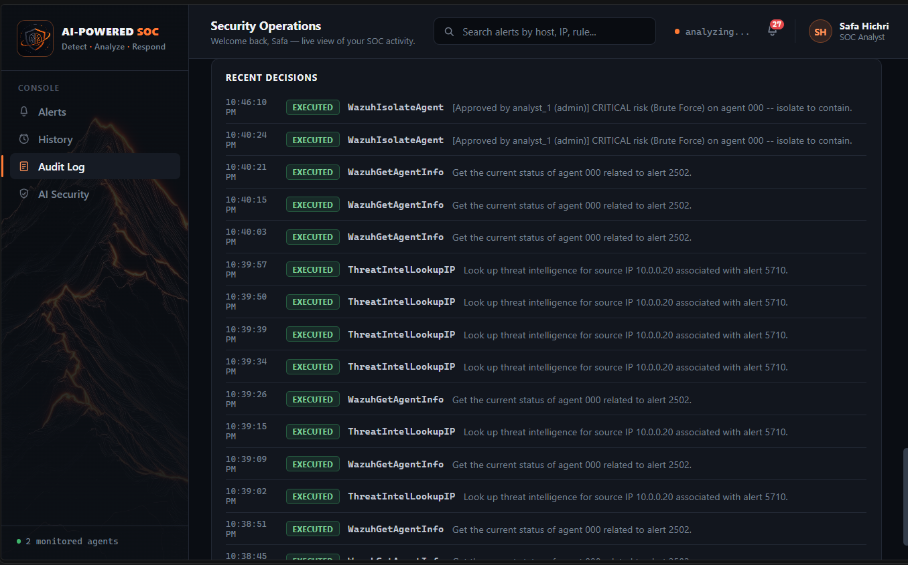
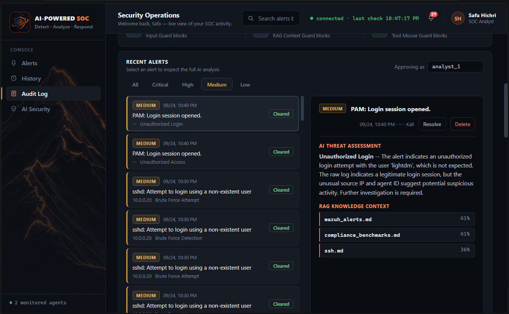
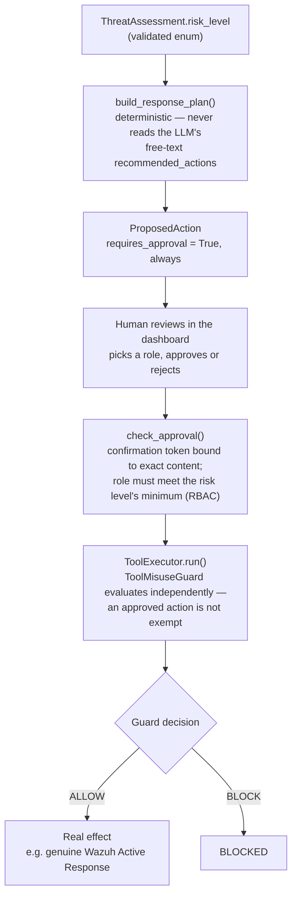
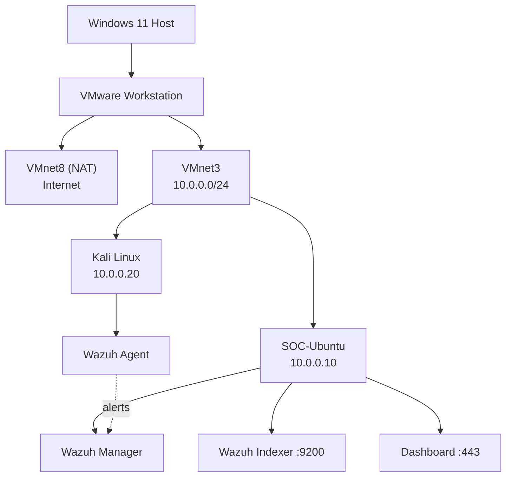
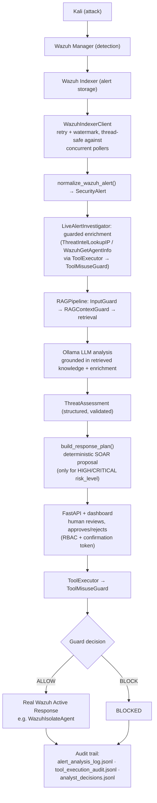

# AI-Powered SOC

An AI-powered Security Operations Center: real Wazuh security alerts are
analyzed by a local LLM through a RAG pipeline, turned into a structured
threat assessment, and — for high-risk alerts — a deterministic SOAR
playbook proposes a response action that only executes after role-gated
human approval.

**The differentiator isn't "an AI analyzes alerts."** It's that the AI
agent itself is treated as part of the attack surface: three independent
guard systems defend it against **prompt injection**, **RAG poisoning**,
and **tool misuse**, each measured with Attack Success Rate (ASR) against
held-out test sets — and the SOAR layer is built so the LLM's free-text
output can never itself become an executed command. See
[`SECURITY.md`](SECURITY.md) for the full per-threat breakdown, including
what's *not* covered yet.

The system runs in a controlled virtualized lab (Wazuh SOC + a Kali
attacker VM) and has been validated end to end against real infrastructure
multiple times: a genuine SSH brute-force attack was detected by Wazuh,
classified CRITICAL by the LLM, proposed for isolation by the SOAR
playbook, approved by a human in the dashboard, and executed as a real
Wazuh Active Response that cut the attacker VM's network access via
`iptables` — then reversed the same way. Separately, a live prompt
injection (an attacker-chosen SSH username reading `"ignore all previous
instructions..."`) and a RAG poisoning attempt (a malicious instruction
embedded in a retrieved knowledge document) were both caught by their
respective guards through the real pipeline, not just in unit tests.

## Security

Three independent guard systems, each measured with Attack Success Rate
(ASR) — the percentage of malicious inputs that get through — rather than
assumed to work.

| Threat | Guard(s) | Test set | ASR |
|---|---|---|---|
| RAG poisoning | `RAGContextGuard` | BIPIA held-out test (200 records) | **0.00%** |
| Tool misuse | `ToolMisuseGuard` | Dev benchmark (89 records) | **0.00%** |
| Tool misuse | `ToolMisuseGuard` | Adversarial paraphrase/social-engineering set | **0.00%** |
| Prompt injection | `InputGuard` + `SemanticGuard` | Evasion corpus (obfuscation/encoding) | **2.00%** |

Full threat-by-threat writeup — attack surface, detection logic, test
methodology, and honest limitations for each of the seven OWASP LLM Top
10-style categories this project considered (including the two that are
**not** addressed) — is in [`SECURITY.md`](SECURITY.md).

### Methodology

- **Calibrated, not guessed** thresholds — `tests/security/calibrate_threshold.py`,
  `calibrate_rag_context_threshold.py`, and `calibrate_alert_semantic_threshold.py`
  each sweep thresholds against labeled reference/validation splits and report
  precision/recall/F1/ASR, rather than picking a number by feel.
- **Held-out test data** — `evaluate_rag_context_guard.py` and
  `evaluate_tool_misuse_guard.py` explicitly document that their threshold was
  never tuned on the reported test set.
- **Live-found bugs, not just synthetic ones** — running real Wazuh alerts
  through the pipeline surfaced a genuine false positive (`SemanticGuard`
  blocking a routine PAM logout, because its threshold was calibrated for chat
  text, not templated alert reports). Root-caused via a dedicated calibration
  run (`data/security/alert_injection/`), fixed by replacing `SemanticGuard`
  with `NullGuard` on that specific path and relying on `InputGuard`'s regex
  layer instead — see `agent/security/null_guard.py` for the full writeup.
  A second live false-negative was found the same way: Wazuh's own sshd
  decoder truncated a multi-word attacker-controlled username before it
  reached the guard, so `format_alert_for_ai()` now also scans Wazuh's
  untruncated `full_log` field.
- **Adversarial robustness, not just clean-set accuracy** — a dedicated
  robustness set (`data/security/tool_misuse/robustness.jsonl`) and an evasion
  corpus (`data/security/prompt_injection_evasion/`) test paraphrase, social
  engineering, and character-level obfuscation (leetspeak, Cyrillic homoglyphs,
  encoding). ASR is reported per attack family/technique, not just in aggregate.
- **Known limitations are tracked, not hidden** — `tests/security/test_prompt_injection_evasion.py`
  keeps one `pytest.mark.xfail(strict=True)` test: French-language phrasing of
  a known attack currently scores under threshold. That's a different problem
  from obfuscation (the embedding model's multilingual coverage, not a text
  trick) and is documented as open rather than silently passing.
- **Live red-team validation, more than once** — real SSH brute-force
  attempts and real prompt-injection/RAG-poisoning attempts from the lab's
  Kali VM were detected by Wazuh, pulled live through `WazuhIndexerClient`,
  and correctly handled by the guards and the decision engine — confirmed
  via the pipeline's own audit trail, not asserted from a unit test alone.

### The three guard systems

**Prompt injection** (`agent/security/input_guard.py`,
`agent/security/semantic_guard.py`) — a fast regex layer plus an embedding-
similarity layer against a reference attack corpus, chained the same way in
every pipeline that uses them (regex first, semantic second).

**RAG poisoning** (`agent/security/rag_context_guard.py`) — checks *retrieved
context* (not just the user query) for indirect prompt injection, using the
same two-layer approach against the BIPIA attack corpus. This is what catches
an attacker-controlled document in the knowledge base trying to override the
LLM's instructions.

**Tool misuse** (`agent/security/tool_misuse_guard.py`) — a deliberately
layered classifier: a sensitive/high-risk tool alone is never sufficient to
block (e.g. a read-only balance lookup on a banking tool stays allowed); a
tool call is blocked only when dangerous *intent* (explicit, paraphrased, or
context-manipulated) is paired with a *capable* tool. Enforced for real via
`agent/tools/executor.py`'s `ToolExecutor` — the single choke point between an
agent's intent to call a tool and the tool's handler actually running. A
`BLOCK` decision is structurally guaranteed to prevent execution; there is no
code path from intent to a real side effect that skips the guard — not even
a human-approved SOAR action, which passes through the identical guard.

**Evasion resistance** (`agent/security/text_normalizer.py`) — all four guards
above additionally check a detection-only normalized copy of their input
(leetspeak reversal, homoglyph-to-Latin mapping, zero-width-character
stripping) alongside the original text. The leetspeak reversal is
token-aware — it only touches tokens with two or more real letters, so IPs,
ports, rule IDs, and CVE numbers in real alert text pass through untouched
while `1gn0r3` and `unl0ck` still get caught.

## Dashboard

Screenshots and a live demo from the lab (real Wazuh alerts, real LLM
analysis, real Active Response — no mocked data).



*A real SSH brute-force attack, detected and classified CRITICAL, isolated only after a role-gated human approval.*


*Live overview: severity breakdown, alert volume, and guard activity computed from the real analysis log over an actual 24-hour window.*


*A real SSH brute-force alert classified CRITICAL: retrieved RAG context above, the role-gated `WazuhIsolateAgent` action below — approved as `admin` and showing EXECUTED.*


*Every Critical/High alert seen this session in one place, each one's real outcome (or "Pending Approval") rather than an assumed one.*


*The merged audit trail — who approved what, under which role, plus the automatic read-only enrichment lookups that never require approval.*


*Filtering to Medium: a routine login alert receiving a full AI assessment without over-reacting to it.*

## Decision engine and SOAR — how the agent stays out of the loop

The LLM's job ends at producing a structured `ThreatAssessment` (threat
type, `risk_level`, confidence, summary). It never decides what to *do*:



This is a mitigation for what OWASP's LLM Top 10 calls **Excessive
Agency** — the risk category this project's architecture is most directly
built around — proven by tests, not just described:
`test_plan_never_reads_recommended_actions_text` asserts the plan is
identical regardless of what the LLM's prose says, and
`test_approval_does_not_bypass_the_guard` asserts a human-approved action
is still blocked if `ToolMisuseGuard` rejects it.

## Architecture



### Data flow (implemented, live-validated)



## Laboratory Environment

### Host Machine

* OS: Windows 11
* CPU: Intel Core i7-13620H
* RAM: 32 GB
* GPU: NVIDIA RTX 2050 4 GB
* Hypervisor: VMware Workstation 17 Pro

### SOC-Ubuntu

* OS: Ubuntu Server 24.04 LTS
* Lab IP: `10.0.0.10`
* Role: SOC server — Wazuh Manager, Indexer (:9200), Dashboard (:443)

### Kali Linux

* OS: Kali Linux
* Lab IP: `10.0.0.20`
* Role: monitored endpoint and red-team attack source
* Wazuh Agent: `4.14.7`

## Implemented Components

### Wazuh SOC Infrastructure

Wazuh Manager, Indexer, Dashboard, and a Wazuh Agent on Kali — deployed,
enrolled, and actively generating real alerts (FIM/Syscheck, SCA, Syscollector,
log collection, Rootcheck).

### AI Data Processing Layer

* `agent/models/security_alert.py` — normalized `SecurityAlert` Pydantic model
* `agent/preprocessing/normalizer.py` — raw Wazuh alert JSON -> `SecurityAlert`
* `agent/preprocessing/formatter.py` — `SecurityAlert` -> AI-friendly text,
  including Wazuh's raw `full_log` line so a decoder truncating a structured
  field doesn't also blind the guards to it

### RAG Pipeline (complete)

* `rag/ingestion/loader.py`, `rag/ingestion/chunker.py` — knowledge document
  loading and chunking
* `rag/embeddings/embedder.py` — sentence-transformers embeddings
* `rag/retrieval/vector_store.py`, `rag/retrieval/retriever.py` — local Qdrant
  vector store and semantic retrieval, with a `build_vector_store()` factory
  that switches to a network Qdrant server only inside the Docker deployment
* `rag/pipeline.py` — `RAGPipeline`: input guard -> semantic guard -> retrieval
  -> RAG context guard -> local LLM generation (Ollama), fully guarded end to
  end

### Decision Engine and SOAR

* `agent/models/threat_assessment.py`, `agent/prompts/threat_assessment_prompt.py`,
  `agent/analysis/threat_assessment_parser.py` — structured
  (`threat_type`, `risk_level`, `confidence`, `recommended_actions`) LLM
  output, parsed defensively (never raises; degrades to `None` on failure)
* `agent/analysis/soar_playbook.py` — `build_response_plan()` (deterministic,
  reads only `risk_level` and fixed alert fields) and
  `execute_proposed_action()` (runs a human-approved action through the
  identical `ToolMisuseGuard`-gated `ToolExecutor` used everywhere else)
* `agent/analysis/approval_policy.py` — role-based approval policy
  (`analyst`/`admin`) with a content-bound confirmation token that
  invalidates if the action is altered after being proposed

### Wazuh API Integration

* `agent/integrations/wazuh_client.py` — `WazuhManagerClient` (JWT auth, agent
  management, Active Response triggering) and `WazuhIndexerClient` (alert
  search), both lazily-authenticating (constructing a client never touches
  the network) with connection retry and watermark-based (`since`/`ascending`)
  polling support

### Live Alert Investigation

* `agent/analysis/live_alert_investigator.py` — `LiveAlertInvestigator`:
  pulls real alerts, runs each through the guarded RAG pipeline,
  deterministically enriches high-value alerts with read-only lookups
  (never LLM-chosen, never state-changing) via `ToolExecutor`, builds a
  SOAR response plan for HIGH/CRITICAL assessments, and supports
  watermark-based polling (`investigate_new`) with a persisted analysis log
  so repeated calls never reprocess the same alert twice

### Tool Execution

* `agent/tools/executor.py` — `ToolExecutor`, the enforcement choke point
  described above, with a structured audit log of every decision (allowed
  and blocked)
* `agent/tools/soc_tools.py` — the SOC tool registry. `WazuhIsolateAgent`
  triggers a real Wazuh Active Response (verified live: it cuts network
  access via `iptables` on the target host and can be reversed the same
  way). Other state-changing tools (firewall, account, case management)
  remain simulated pending real integration — see `SECURITY.md` and the
  Development Status section below for exactly which.

### API and Dashboard

* `api/main.py`, `api/dependencies.py`, `api/schemas.py` — a FastAPI service
  over `LiveAlertInvestigator`: polling/recent-alert endpoints, a merged
  audit-log endpoint, and `POST /actions/approve` / `POST /actions/reject`,
  both of which go through the same `check_approval()` + `ToolMisuseGuard`
  path described above — the API adds no bypass
* `dashboard/index.html` — a single-page analyst console (no build step,
  no external JS dependency) showing live alert cards with the AI's
  reasoning, the RAG context that grounded it, guard-blocked alerts with
  the real blocking layer and reason, and role-gated approve/reject on
  proposed SOAR actions with a required justification field

## Development Status

### Completed

* [x] Virtualized lab (SOC-Ubuntu + Kali), Wazuh stack deployed and generating
      real alerts
* [x] Security alert normalization, formatting, and full RAG pipeline
      (embeddings, vector store, retrieval, local LLM generation)
* [x] Three-pillar security layer (prompt injection, RAG poisoning, tool
      misuse) with calibrated thresholds and measured ASR
* [x] Evasion/obfuscation resistance (leetspeak, homoglyphs) across all four
      guards
* [x] Real Wazuh Manager + Indexer API integration, live-validated
* [x] Guarded tool execution loop (`ToolExecutor`) with audit logging
* [x] Live alert investigation with watermark polling, persisted analysis
      log, and guarded automatic enrichment
* [x] Structured decision engine (`ThreatAssessment`) and a deterministic
      SOAR playbook that never reads the LLM's free text as a command
* [x] Role-based approval policy (RBAC) with content-bound confirmation
      tokens for every state-changing action
* [x] Real Active Response for host isolation (`WazuhIsolateAgent`) —
      live-validated: genuine `iptables` isolation and reversal on the lab's
      Kali VM
* [x] FastAPI service and a single-page analyst dashboard (alert cards, AI
      reasoning, RAG context, guard-blocked reasons, approve/reject with
      audit trail)
* [x] CI (GitHub Actions) running the automated test suite on every push
* [x] Containerization (`Dockerfile` + `docker-compose.yml`), with the RAG
      vector store able to run as a network Qdrant service instead of the
      embedded local-file store
* [x] End-to-end live validation, more than once: a real Kali-launched SSH
      brute-force escalated to a real, human-approved, real Active Response
      isolation; a real prompt-injection attempt and a RAG-poisoning attempt
      each caught live by their respective guards
* [x] 177 automated tests (`pytest -q`)
* [x] Master/detail alert triage UI (severity-filtered list + detail pane),
      a Critical/High history view, and an in-browser critical-alert
      notification (sound + toast) driven by real poll results
* [x] Analyst-facing alert lifecycle (Resolve/Delete) backed by its own
      persisted status store — never mutates the underlying alert, analysis
      log, or audit/decision trail

### In Progress / Planned

* [ ] Close the remaining French/multilingual prompt-injection gap
      (tracked via `xfail`)
* [ ] Real integration for the remaining simulated SOC tools (firewall
      block/allow, account disable/reset, case management) — currently only
      `WazuhIsolateAgent` is real
* [ ] Data exfiltration and memory poisoning controls — not addressed;
      memory poisoning currently has no attack surface to defend, since the
      system has no persistent cross-session memory component (see
      `SECURITY.md`)
* [ ] Machine learning pipeline — the security/analysis layer is entirely
      LLM- and embedding-based today; a dedicated ML pipeline was scoped
      early on but not built

## Technologies

* Python, Pydantic, Pytest
* FastAPI, Docker / Docker Compose
* Wazuh (Manager, Indexer, Dashboard, Agent)
* sentence-transformers, Qdrant (embedded local store, or a networked
  server via Docker)
* Ollama (local LLM inference)
* VMware Workstation

## Project Structure

```text
ai-powered-soc/
|
├── agent/
│   ├── analysis/
│   │   ├── live_alert_investigator.py
│   │   ├── soar_playbook.py
│   │   ├── approval_policy.py
│   │   └── threat_assessment_parser.py
│   ├── integrations/
│   │   └── wazuh_client.py
│   ├── llm/
│   │   └── ollama_client.py
│   ├── models/
│   │   ├── security_alert.py
│   │   └── threat_assessment.py
│   ├── preprocessing/
│   │   ├── formatter.py
│   │   └── normalizer.py
│   ├── prompts/
│   │   ├── security_analysis.py
│   │   └── threat_assessment_prompt.py
│   ├── security/
│   │   ├── input_guard.py
│   │   ├── semantic_guard.py
│   │   ├── rag_context_guard.py
│   │   ├── tool_misuse_guard.py
│   │   ├── null_guard.py
│   │   └── text_normalizer.py
│   └── tools/
│       ├── executor.py
│       ├── registry.py
│       └── soc_tools.py
|
├── api/
│   ├── main.py
│   ├── dependencies.py
│   └── schemas.py
|
├── dashboard/
│   └── index.html
|
├── data/security/
│   ├── prompt_injection_evasion/
│   ├── alert_injection/
│   ├── rag_poisoning/
│   └── tool_misuse/
|
├── evaluation/
│   ├── benchmark_runner.py
│   └── robustness_runner.py
|
├── rag/
│   ├── embeddings/embedder.py
│   ├── ingestion/{chunker,loader,build_knowledge_base.py}
│   ├── knowledge/documents/
│   ├── retrieval/{retriever,vector_store,context_builder}.py
│   └── pipeline.py
|
├── tests/
│   └── security/          # guard unit tests, calibration and evaluation scripts
|
├── .github/workflows/tests.yml
├── Dockerfile
├── docker-compose.yml
├── .env.example
├── requirements.txt
├── LICENSE
├── SECURITY.md
└── README.md
```

## Setup and Running

### Local (no Docker)

```powershell
pip install -r requirements.txt
cp .env.example .env   # fill in your Wazuh/Ollama connection details
uvicorn api.main:app --host 127.0.0.1 --port 8000
```

Then open `http://127.0.0.1:8000/dashboard/`. The knowledge base needs to
be populated once:

```powershell
python -m rag.ingestion.build_knowledge_base
```

### Docker

```bash
docker compose up --build
```

This runs the API/dashboard alongside a real Qdrant server (instead of the
embedded local-file store) — see `docker-compose.yml` for the environment
variables it expects for the Wazuh and Ollama connections. Populate the
knowledge base once against the running stack:

```bash
docker compose run --rm api python -m rag.ingestion.build_knowledge_base
```

## Testing

```powershell
python -m pytest -q
```

CI (`.github/workflows/tests.yml`) runs the same command against a few
excluded/deselected tests that need a live Ollama server or the BIPIA
benchmark corpus (an external academic dataset, gitignored, not committed)
— both are named explicitly in the workflow file, not hidden.

Security-specific evaluation and calibration scripts (not run in the default
`pytest` pass — they load embedding models and external datasets):

```powershell
python -m tests.security.evaluate_rag_context_guard
python -m evaluation.benchmark_runner
python -m evaluation.robustness_runner
python -m tests.security.evaluate_prompt_injection_evasion
```

## Security Considerations

The project is developed in a controlled laboratory environment.

Sensitive information must never be committed to the repository, including:

* Passwords, API tokens, API keys, private keys
* Wazuh agent/API authentication keys
* `.env` files containing secrets
* Raw sensitive logs

Local secrets belong in a local `.env` (see `.env.example`), which is
gitignored. `WazuhManagerClient`/`WazuhIndexerClient` load it automatically via
`python-dotenv` and never make a network call at construction time — only when
a request is actually made — so the tool registry stays safe to build even
when the lab VMs are offline or credentials aren't configured yet.

## License

[MIT](LICENSE)

## Project Objective

Build an AI-powered SOC that combines real-time security monitoring, RAG-based
contextual enrichment, and agentic reasoning over live security data — with a
security layer that treats "the agent itself can be attacked" as a first-class
design constraint, not an afterthought. The measured ASR numbers above are the
project's central claim: not that the system is unbreakable, but that its
defenses are tested against real adversarial input and its remaining gaps are
known and tracked rather than assumed away.
